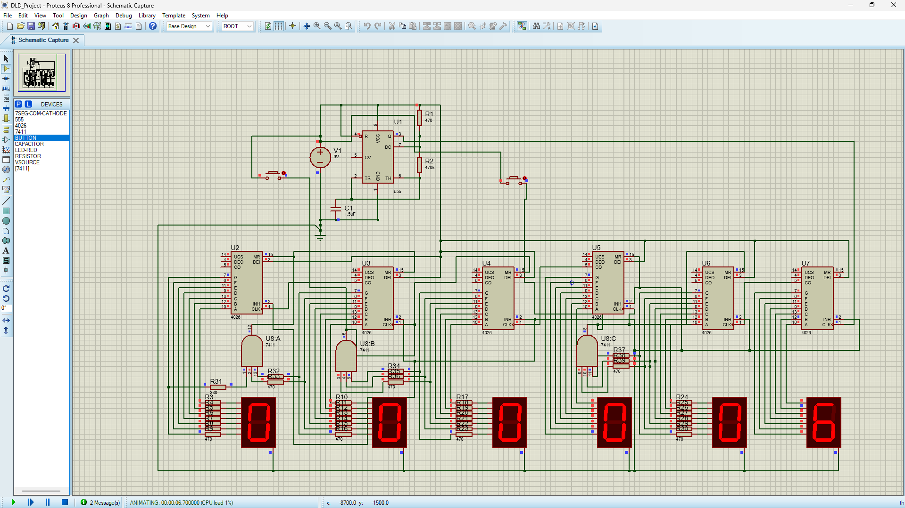

# 24-Hour Digital Clock / Counter

This repository showcases a 24-Hour Digital Clock / Counter circuit implemented and simulated using the Proteus Design Suite. Designed to demonstrate practical applications of digital electronics and logic gates.

## 📸 Screenshots & Showcase

### Circuit Simulation


### Hardware Implementation / Breadboard View


## 🛠️ Built With

- **Proteus Design Suite** - For circuit design and simulation.

## 📂 Folder Structure

```text
Project Directory/
├── circuit_simulation.png              # Simulation screenshot
├── hardware_implementation.jpg         # Project photo / hardware image
├── README.md                           # Project documentation
└── 24_Hour_Digital_Clock.pdsprj     # Main Proteus project file (Core project file)
```

## 🚀 How to Run

1. Ensure you have **Proteus Design Suite** installed on your system.
2. Clone this repository or download the files.
3. Open `24_Hour_Digital_Clock.pdsprj` in Proteus.
4. Click the **Play** button at the bottom left to start the simulation and observe the circuit's behavior.

## 📝 About the Circuit
> This project implements a 24-Hour Digital Clock / Counter using standard logic gates.

---
*If you have any questions or want to learn more about this project, feel free to reach out!*
